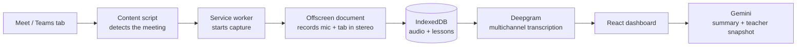

# TeachAssist AI

**A Chrome extension and dashboard that records online English classes, turns them into speaker-accurate transcripts, and uses AI to summarize each lesson for the teacher.**

I teach English 1:1 online, and the details of a class disappear the moment it ends: which mistakes came up, what vocabulary we covered, what to review next time. I built TeachAssist AI to capture all of it automatically, so every lesson becomes a searchable transcript, a summary, and a snapshot I can use to plan the next class.

---

## What it does

- **One-click recording** of Google Meet and Microsoft Teams classes, from the toolbar or with **Ctrl+Shift+F**
- **Speaker-accurate transcripts.** The teacher's microphone and the student's audio are recorded on separate stereo channels, so the transcript always knows who said what, with no guessing
- **AI lesson summaries.** Gemini turns each transcript into a lesson summary and a teacher snapshot
- **A lesson dashboard** (React) to browse past classes, read transcripts, and review summaries
- **No lost classes.** Audio is saved to the browser as it records; every lesson has a clear status (Ready, Processing, Needs Attention), and failed transcriptions can be retried without re-recording

## How it works



## Problems I solved

**Who said what.** Most transcription tools guess speakers with diarization, which often mixes up teacher and student. TeachAssist records the teacher's microphone on the left channel and the student's audio on the right, then sends one stereo file to Deepgram with multichannel transcription. Speaker labels come from the channel, so they are always correct.

**Hour-long recordings that vanished.** Long classes were failing silently. I traced two causes: a race condition in the retry logic, and Chrome's 64 MiB limit on extension messages, which a 60-minute recording exceeds. I redesigned how audio moves from the extension to the dashboard, so large files never pass through extension messaging, and verified the fix on a live 61-minute class.

**Recovering from failures.** If a transcription fails because of a network error or a missing key, the lesson is marked *Needs Attention* with diagnostic logs, and the teacher can retry it with one click. The audio is never thrown away.

## Tech stack

- **Chrome Extensions, Manifest V3**: service worker, offscreen document, `tabCapture`
- **JavaScript** for the extension, **React** (built with Vite) for the dashboard
- **IndexedDB** for audio chunks, lessons and logs
- **Deepgram API** for speech-to-text
- **Gemini API** for summaries and teacher snapshots

## Project structure

```
├── manifest.json         Extension configuration
├── background.js         Service worker: recording flow, jobs, transcription
├── content.js            Detects Meet / Teams meetings
├── offscreen.js          Captures and mixes audio
├── popup.*               Toolbar popup
├── settings.*  setup.*   API key and first-run setup pages
├── services/             Lessons, recordings, jobs, logging and storage
├── dashboard/            Built React dashboard
└── icons/                Toolbar icons for each recording state
```

## Getting started

1. Download this repository (**Code → Download ZIP**) and unzip it.
2. In Chrome, open `chrome://extensions` and turn on **Developer mode**.
3. Click **Load unpacked** and select the unzipped folder.
4. Open the extension's **Settings** and paste your **Deepgram API key**.
5. Click **Open Dashboard**, go to the dashboard settings, and paste your **Gemini API key**.
6. Join a Google Meet or Teams call and press **Ctrl+Shift+F** to start recording.

**API keys are never stored in the code.** They are entered in the settings pages, kept in Chrome's local storage on your own computer, and removed from all logs.

## Privacy

Recordings, transcripts, and lessons are stored locally in your browser. Audio is sent only to Deepgram for transcription, and transcripts only to Gemini for summaries. Always ask for your students' consent before recording a class.

## Status

In active development and being tested on live classes. Built through AI-assisted development with ChatGPT and Claude.

---

**Amanda Santos**, educator building AI learning tools · [LinkedIn](https://www.linkedin.com/in/amanda-richelle-peffer-dos-santos-20802b263)
